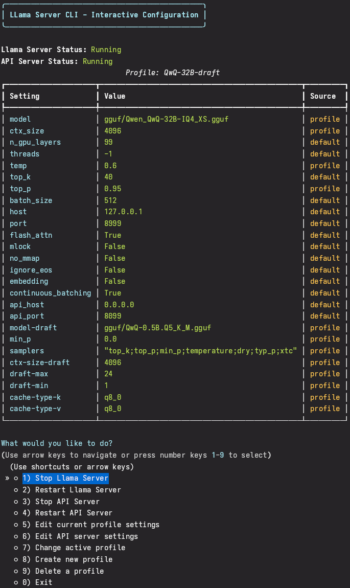

# Llama Server CLI


A simple, user-friendly CLI tool for managing, and running, [llama.cpp](https://github.com/ggml-org/llama.cpp)'s [llama-server](https://github.com/ggml-org/llama.cpp/tree/master/examples/server) with multiple configuration profiles and providing OpenAI-compatible API access.

<details>
<summary>

## Image of the interactive interface

</summary>



</details>

## Key Features
*   **Simple Single-File Deployment** - run everything from one file with minimal setup.
*   **Interactive Menus** - Navigation with arrow keys or numbered options.
*   **Model Specific Profiles** - create and switch between different model configurations effortlessly.
*   **OpenAI-Compatible API** - use your local models with any application supporting OpenAI's API format. (TODO)
*   **Streaming for Tool Calls** - Simulates streaming 
responses for function calling even though it is not 
natively supported in llama.cpp.
*   **Instant Config Changes** - settings take effect immediately when switching or editing profiles.
*   **Auto-Managed Configs** - The profiles files are created and updated automatically—no manual edits needed.

## Installation

0. Compile `llama-server` from [llama.cpp](https://github.com/ggerganov/llama.cpp). If compiling works, and you are using Nvidia CUDA, you can try using `llama-server-help-script/compile-llama-server.sh`.

1. Place the `llama-server-cli.py` file in the same directory as your `llama-server` executable.

2. Install the required Python packages:

```bash
pip install typer rich questionary prompt_toolkit fastapi uvicorn
```

3. Create a `gguf` folder for your models if you don't already have one:

```bash
mkdir -p gguf
```
4. (Optional) Download a GGUF model file using the `pull-gguf.sh` script.
<details>

<summary>
Either of the following commands will work.

</summary>

```
# File URL
./llama-server-help-script/pull-gguf.sh https://huggingface.co/USER/MODEL/resolve/main/MODEL_FILE_NAME.gguf

# Model URL and file name
./llama-server-help-script/pull-gguf.sh https://huggingface.co/USER/MODEL MODEL_FILE_NAME.gguf

# User/model and file name
./llama-server-help-script/pull-gguf.sh USER/MODEL MODEL_FILE_NAME.gguf

# User/model/file name
./llama-server-help-script/pull-gguf.sh USER/MODEL/MODEL_FILE_NAME.gguf
```

</details>

## Recommended Directory Structure

```
.
├── llama-server     # The llama-server executable
├── llama-server-cli.py     # The CLI tool
├── config.json      # Auto-generated config file (don't edit directly)
└── gguf/            # Folder containing your GGUF model files
    ├── model1.gguf
    └── model2.gguf
```

## Usage

### Interactive Mode (Recommended)

Simply run the tool without arguments to enter interactive mode:

```bash
python llama-server-cli.py
```

In interactive mode, you can:
- Switch between profiles
- Edit settings
- Create and delete profiles
- Start the server in the background
- Change settings with instant auto-restart
- Select models from a list of available GGUF files
- Configure and manage the OpenAI-compatible API server

<details>

<summary>Command-Line Arguments (Advanced)</summary>

You can also use command-line arguments for specific operations:

```bash
# Create a profile
python llama-server-cli.py create-profile my_profile

# Set model path
python llama-server-cli.py set-setting my_profile model ./gguf/my_model.gguf

# See all available profiles
python llama-server-cli.py list-profiles

# Start server with a specific profile
python llama-server-cli.py start-server --profile my_profile

# Start OpenAI-compatible API server
python llama-server-cli.py start-api

# Stop API server (if needed)
python llama-server-cli.py stop-api
```
</details>

## Quick Start

1. Create a profile for your model:

```bash
python llama-server-cli.py
```

2. From the interactive menu:
   - Choose "Create new profile"
   - Enter a name for your profile
   - Select "Edit current profile settings"
   - Choose "Set model" and select your model from the list
   - Adjust other settings as needed
   - Start the server with your profile

## OpenAI API Compatibility

The tool includes an OpenAI-compatible API server that allows you to use your local llama-server with applications that support the OpenAI API format:

1. **API Configuration**: Configure the API server host and port through the interactive menu or config.json
2. **Automatic Profile Switching**: The API server automatically switches between profiles based on the requested model
3. **Chat Completions**: Supports the `/v1/chat/completions` endpoint with streaming capabilities
4. **Tools Support**: Simulates streaming for tool calls (function calling) even though llama.cpp doesn't natively support this combination
5. **Models Endpoint**: Exposes profiles as models via the `/v1/models` endpoint

## Background Server Operation

The CLI tool allows you to:

1. **Start the server in the background**
2. **Continue using the CLI** while the server is running
3. **See server status** in the main menu
4. **Restart or stop the server** directly from the main menu
5. **Change settings on-the-fly** - any settings change automatically restarts the server seamlessly

## Model Selection

When setting the model path, the tool will:
1. Automatically scan the `gguf` directory for model files
2. Present a list of all available models
3. Allow you to select a model from the list
4. Also offer an option to enter a custom path manually

## TODO
- Add better logging for llama-server
- Add better logging for llama-server-api

## Troubleshooting

- Use the keyboard arrows to re-draw the interface if the interface is not displaying correctly.
- If the server fails to start, check the error messages for required settings
- Ensure your model file path is correct
- Verify that you have sufficient RAM/VRAM for your model size
- For API issues, check that both the llama-server and API server are running
- Port conflicts can be resolved by changing the port in the API settings
